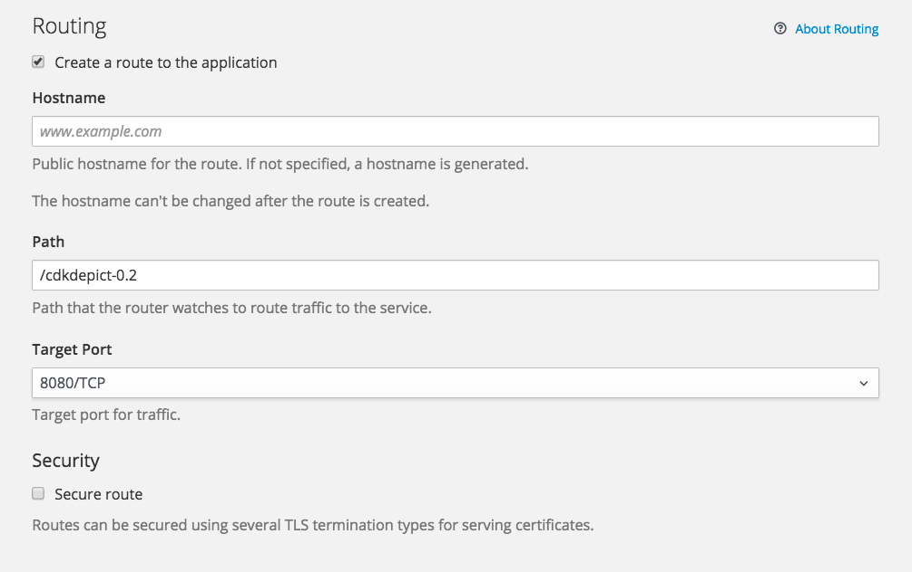
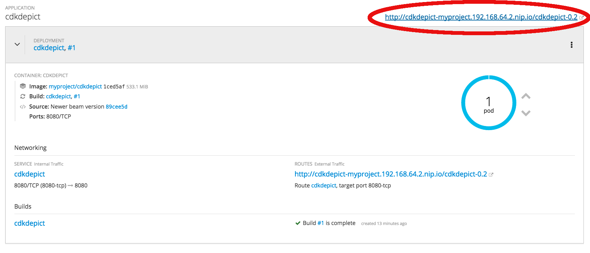

# Running CDK-Depict on OpenShift

1. From the UI choose "Add to Project" -> "Browse Catalogue", pick "Java" and select "WildFly"
2. Name it, e.g., "cdkdepict" and point it to the github at: `https://github.com/cdk/depict.git`
3. We need to tell Maven to only produce the war file and no jar (becuase the wildfly template will try and fail on the jar file) and we also tell it to skip the tests.  
   So, "Show advanced options", and
4. under **Build Configuration** add Environment variable `MAVEN_ARGS` with the value `compile war:war -Popenshift -DskipTests -B`

   
5. In order to reach the service it is nice to configure the route. Under **Routing** set Path to `/cdkdepict-0.2`  

   
5. Click "Create"
6. Continue to overview

OpenShift will now checkout CDK Depict from Github, build it, and run it.

In the upper corner of the overview for the application there is a link. Clicking on it will take you to the now runnign CDK-depict app.
   
   

