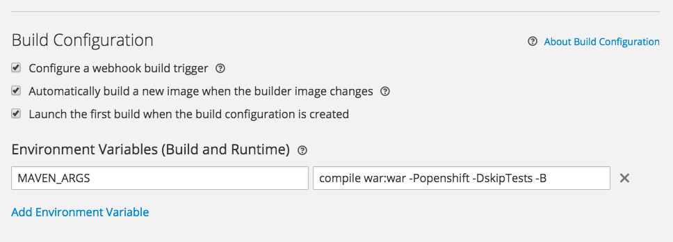

# Running CDK-Depict on OpenShift

1. From the UI choose "Add to Project" -> "Browse Catalogue", pick "Java" and select "WildFly"
2. Name it, e.g., "cdkdepict" and point it to the github at: `https://github.com/cdk/depict.git`
3. Shoow advanced options and
4. Under Build Configuration add Envirnment variable `MAVEN_ARGS` with the value `compile war:war -Popenshift -DskipTests -B`

   
5. Click "Create"
6. Continue to overview

OpenShift will now checkout CDK Depict from Github and build it.
