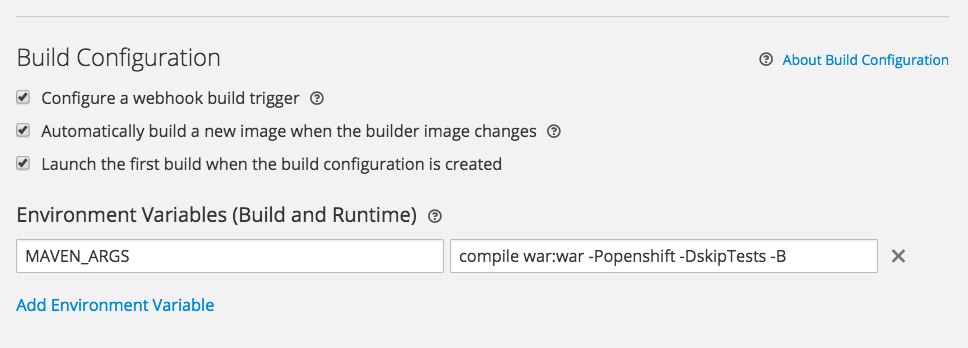
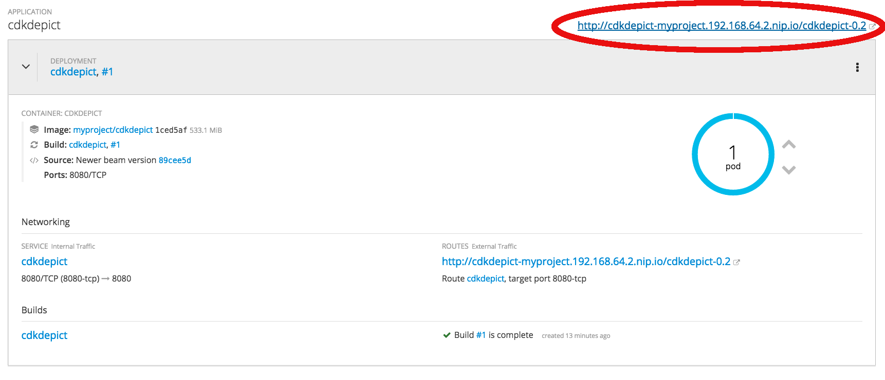

# Running CDK-Depict on OpenShift
This recipe describes how to get the [CDK-Depict](https://github.com/cdk/depict) application running in OpenShift.

It assumes you already have an OpenShift environment running (see recipes for doing this with [minishift](minishift_local_machine.md)
or on a [centos machine](openshift_centos.md)).

CDK Depict is a small web service application for generating chemical structure depictions based on the [Chemistry Development Kit](https://cdk.github.io/) (CDK, doi:[10.1186/s13321-017-0220-4](https://jcheminf.biomedcentral.com/articles/10.1186/s13321-017-0220-4)) and is created by [John Mayfield](https://github.com/johnmay). We will use OpenShift to check it out from GitHub, run it's Maven build, and deploy it:

1. From the UI choose **Add to Project** -> **Browse Catalogue**, pick **Java** and then select **WildFly**
2. Name it, e.g., "_cdkdepict_" and point to the github repository at: `https://github.com/cdk/depict.git`

The first deployment may fail, as the wizards do not allow us to set which tag we want to use, e.g. the `1.3` tag.
So, we may need to tweak the building.

3. We need to tell Maven to only produce the `.war` file and no `.jar` file (becuase the wildfly template will try and fail on the `.jar` file). We also tell it to skip the tests.  
   So, show **advanced options**, and
4. in **Context Dir** add `/cdkdepict-webapp` and
4. under **Build Configuration** add an environment variable `MAVEN_ARGS` with the value `compile war:war -Popenshift -DskipTests -B`

   
5. In order to reach the service it is nice to configure the route to take us straight to the application. Under **Routing** set the path to ~~`/cdkdepict-0.2`~~ `/cdkdepict-webapp-1.3`

   
5. Click "Create"
6. Continue to overview

OpenShift will now checkout CDK Depict from Github, build it, and run it.

In the upper corner of the overview for the application there is a link. Clicking on it will take you to the now runnign CDK-Depict app.
   
   

