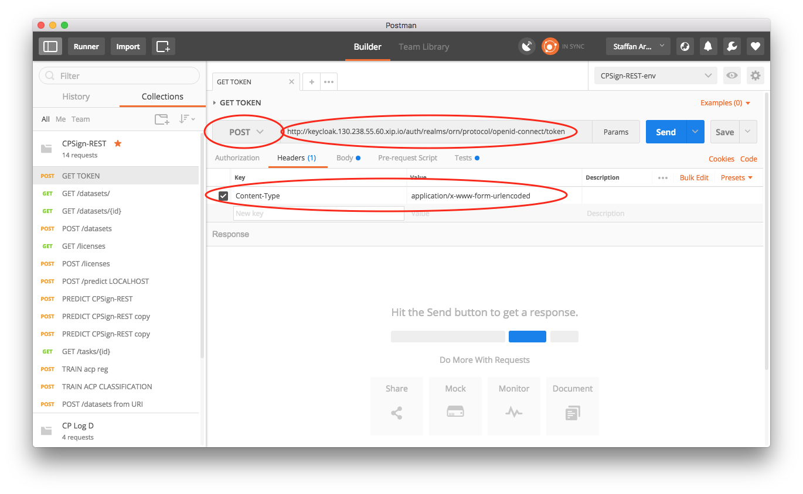
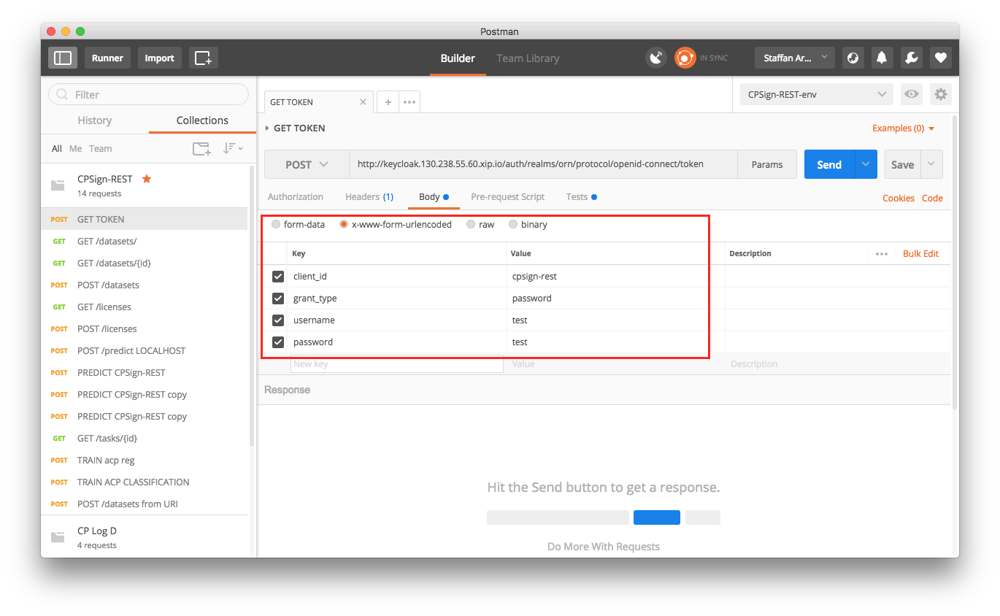
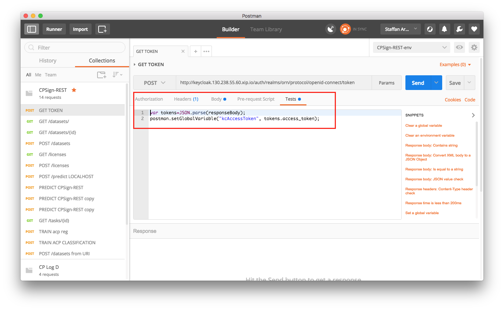
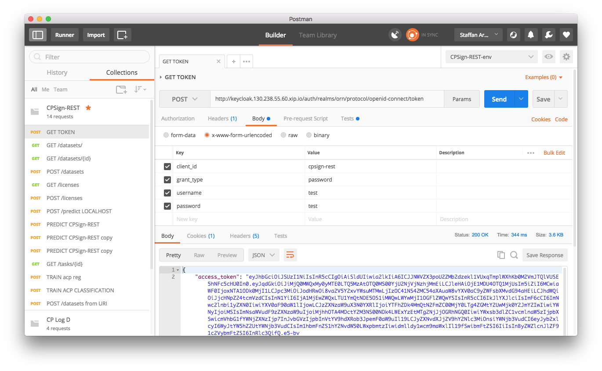
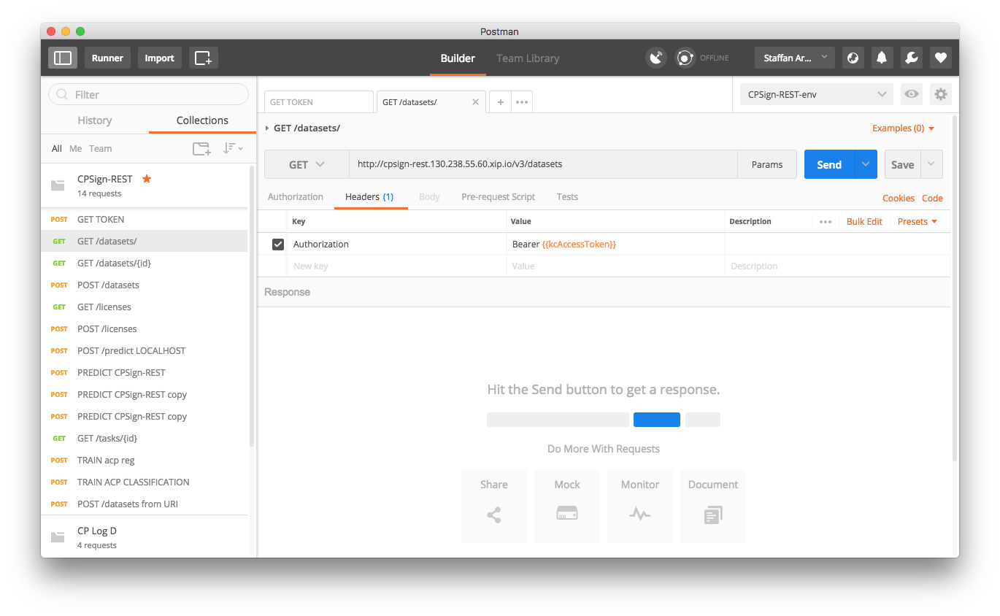

# Getting token from Keycloak
This recipe assumes that a keycloak instance is present and configured properly. In this example we are using the [openID-connect](http://openid.net/connect/ "OpenID-connect") protocol 
and we use the **realm** "orn". Here we show different ways to authenticate yourself to keycloak and in return get an access-token 
that can be used for authorizing at a particular service secured by that keycloak instance. 

1. [Authenticating using Postman](#authenticating-using-postman)
2. [Authenticating using cURL](#authenticating-using-curl)
3. [Authenticating in Java](#authenticating-in-java)

Note that the token should be configured to expire in a certain amount of time, so either the token must be refreshed or a new token must be
acquire once the old one has expired. 

## Authenticating using Postman
[Postman](https://www.getpostman.com/ "Postman") is a flexible tool for developing and testing REST services in a graphical manner.
In this recipe we're using Postman version 5.1.3 for Mac, things might look slightly different in a different version of the tool.

### 1. Configure parameters
In a new tab, choose "POST" as HTTP method, enter the request URL following:
```
http://[URL to keycloak]/auth/realms/[your realm]/protocol/[authentication protocol]/token
```
Under the **Headers** tab, enter key="Content-Type" and value="application/x-www-form-urlencoded"

Here's an example of how to fill this in:



Under the **Body** tab, choose radio button **x-www-form-urlencoded** and fill in the parameters following this image (change `client_id`, `username` and `password` values to appropriate ones)



### 2. (Optional) Configure global access token
If you only want the access token and will use it somewhere else you can skip this section. However, I you want to use the token
in further calls in Postman to test your service secured by keycloak, you can configure a global variable holding the token for you, so no copy-paste is needed.
Under the **Tests** tab, enter the following code:
```
var tokens=JSON.parse(responseBody); 
postman.setGlobalVariable("kcAccessToken", tokens.access_token); 
```
This will configure a global variable called `kcAccessToken` that will be updated with the access token for every time you run this request.



### 3. Run the request
Now press the blue **Send** button to perform the request. If everything goes well, there result should look something like this:



Where the lower section of the window shows the response from keycloak, to the right it says "Status: 200 OK" and the **Body** tab
shows a JSON response from the server, carrying both the **token** (access_token) and information about when the token expieres among other info.

### 4. (Optional) Use the token in other Postman requests 
If you want to continue testing a REST service from within Postman, first make sure you followed the instructions in the optional
[step 2](#2-optional-configure-global-access-token). Then your request should have initiated the global variable `kcAccessToken` with your access token and that should 
be ready to use. Open up a new request tab in Postman, choose your request-type, url and set parameters. In the **Headers** tab under the request URL field,
add a parameter **Authorization** with the value=`Bearer {{kcAccessToken}}` which simply populates the Authorization field in the HTTP request,
and `{{kcAccessToken}}` will autoreplace the value stored in the gobal variable `kcAccessToken`. The parameters should look like this (note that `{{kcAccessToken}}` 
should be displayed with orange color, red means that this variable is not initiated). 




## Authenticating using cURL
Authenication can be performed using [cURL](https://curl.haxx.se/ "cURL") directly, for the command-line/bash inclined. Here is how
you perform the cURL command:
```
RESULT=`curl --data "grant_type=password&client_id=[your-client id]&username=[your user name]&password=[your password]" http://[keycloak url]/auth/realms/[your realm]/protocol/[connection protocol]/token`
```
With some example values:
```
RESULT=`curl --data "grant_type=password&client_id=cpsign-rest&username=my_user&password=my_pwd" http://keycloak.130.238.55.60.xip.io/auth/realms/orn/protocol/openid-connect/token`
```
This will return a JSON string with the same output as the one gotten using Postman and the access token can be retreived 
by using the following command:
```
TOKEN=`echo $RESULT | sed 's/.*access_token":"//g' | sed 's/".*//g'`
```

The access token will now be stored in the `TOKEN` variable and can be used for further cURL commands or elsewhere. The token is added as a 
HTTP header in further cURL commands simply by adding `-H "Authorization: bearer $TOKEN"` to commands, example:
```
curl -X GET "[your request url]" -H "accept: application/json" -H "Authorization: bearer $TOKEN"
```


## Authenticating in Java
In this section we're using [Apache HttpComponents](https://hc.apache.org/) project for dealing with the HTTP protocol. 

```
HttpPost postReq = new HttpPost(new URI(keycloakAuthURL));

// list of parameters
List<NameValuePair> params = new ArrayList<>();
params.add(new BasicNameValuePair("client_id", clientID));
params.add(new BasicNameValuePair("grant_type", "password"));
params.add(new BasicNameValuePair("username", userName));
params.add(new BasicNameValuePair("password", pwd));

// add the parameters to the request
postReq.setEntity(new UrlEncodedFormEntity(params,"UTF-8"));

// execute the request
HttpResponse response = HttpClientBuilder.create().build().execute(postReq);

// verify authentication was OK
if(response.getStatusLine().getStatusCode() != 200)
   throw new RuntimeException("Could not authenticate");
   
// use your favorite JSON-parser to convert response.getEntity() into some JSON-object
JSONObject json = ... 
String token = (String) json.get("access_token");
```

Once you got your `token` it's easy to use in later requests by adding it to the Authorization HTTP header using: 
```
HttpUriRequest request = ... // some HTTP-method, i.e. new HttpGet(new URI("..."));
request.addHeader(new BasicHeader("Authorization", "Bearer " + token));
```

